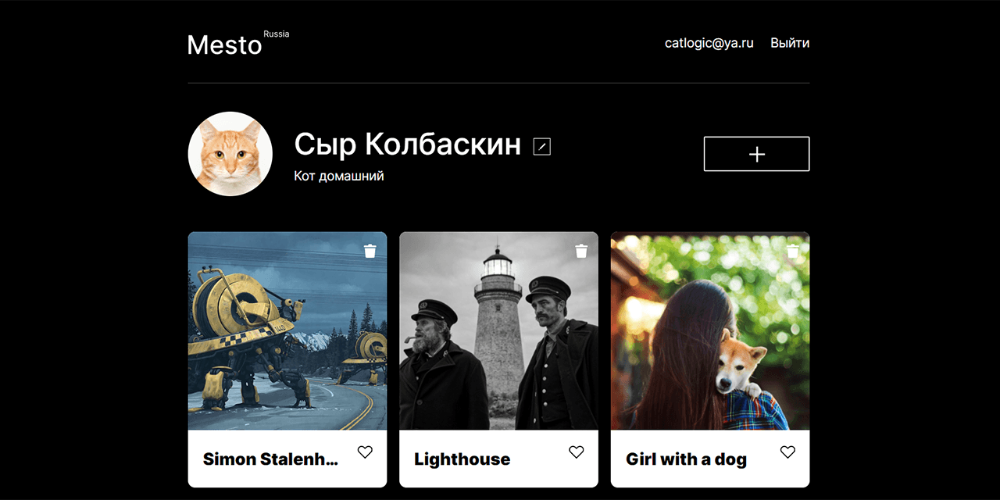

# Спринт 15: Место
**Учебная работа в Яндекс Практикуме**

Пятнадцатая учебная проектная работа на курсе Яндекс Практикума "Веб-разработчик". Одностраничное приложение, имитирующее страницу пользователя с галереей, с функцией регистрации/аутентификации, собирающее данные с серверного API.

#### Обновления

* 13.11.2020
    * Добавлен функционал регистрации пользователя
    * Добавлен механизм авторизации и аутентификации с использованием localStorage браузера
    * Добавлена живая валидация всех форм
    * Оптимизирован код, произведен рефакторинг

### Технологии

* Верстка по стандарту HTML5, стили страницы - стандарт CSS3.
* Динамическая часть реализована на JavaScript ES6 (объектно-ориентированный и функциональный подходы, асинхронное программирование, Fetch API).
* Соблюдена семантика HTML. Использованы технологии CSS Flexbox, Grid, transitions.
* Предусмотрены случаи переполнения текстовых полей.
* Функционал React:
    * Функциональные компоненты со четко определенной логикой, декларативный подход
    * Использованы функции Context, Ref, Redirect, Route, Switch
    * Применены хуки useState, useEffect, useContext, useRef, useCallback, useHistory
    * Для сборки и тестирования применен Create React App
* Функционал проекта:
    * геренируемая галерея пользователей из данных, получаемых с сервера
    * редактируемые данные пользователя и аватар, получаемые с сервера
    * отображение количества лайков из серверных данных, добавление/удаление лайков
    * возможность добавлять и удалять элементы галереи
    * открытие модальных окон для редактирования данных
    * модальные окна с просмотром изображений при нажатии на них в галерее (lightbox)
    * закрытие модальных окон "крестиком", кликом по пустой области, клавишей Esc
    * работа с серверным API, авторизация, отправка HTTP-запросов, получение и отправка данных, обработка ошибок
    * регистрация пользователя, получение токена от серверного API
    * проверка токена пользователя через серверное API
* Адаптирован под различные устройства - поддерживается разрешение экрана от 320 до 1280 и более пикселей по ширине.
* Для HTML-элементов, стилей и файловой структуры применена методология БЭМ.
* Комментарии к коду описаны в стандарте JSDoc.
